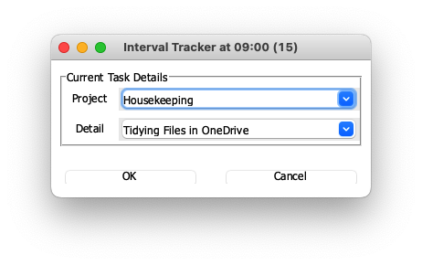
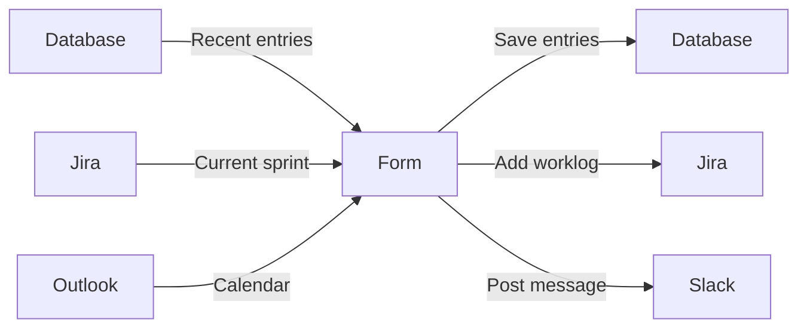

<div align="center">

[](https://www.python.org/downloads/release/python-3110/)
[](https://python-poetry.org/)
[](https://github.com/Bilbottom/daily-tracker/actions/workflows/tests.yaml)
[](https://github.com/dbrgn/coverage-badge)
[](https://shields.io/)

[](https://github.com/prettier/prettier)
[](https://github.com/astral-sh/ruff)
[](https://results.pre-commit.ci/latest/github/Bilbottom/daily-tracker/main)
[](https://sourcery.ai)

</div>

---

# Daily Tracker ⏱️📝

An application for keeping track of tasks throughout the day.

Not sure where all your time goes? I wasn't either 😄 This application generates a pop-up box every 15 minutes (configurable) to fill out what you're currently working on.

> This is a work in progress. I'm currently using it to track my time, but it's not yet ready for public consumption.

## ✨ Features

The GUI is currently built with [Tkinter](https://docs.python.org/3/library/tkinter.html) and looks like:

<div align="center">
    
</div>

This pop-up box has the following features:

- Drop-down box to select from recent projects
- Drop-down box to select the selected project's recent details
- By default, autopopulates the project and details from the previous entry
- Has a Streamlit front-end for viewing and editing the data
- Integrates with [Outlook ](https://outlook.live.com/owa/) (macOS and Windows)
  - Reads the calendar and autofills with meeting information
- Integrates with [Jira ](https://www.atlassian.com/software/jira)
  - Reads tickets in the current sprint and adds them to the project drop-down
  - Adds a worklog to the ticket when the form is submitted
- Integrates with [Slack ](https://slack.com/)
  - Posts a message to channel when the form is submitted



## 🔧 Resources and dependencies

The clock icon is from [icons8.com](https://icons8.com/):

- https://icons8.com/icon/2YPST59G2xJZ/clock

### 🍎 On macOS

On macOS, you will probably need to install the Tcl/Tk framework:

```bash
brew install tcl-tk
```

This has been tested and confirmed to work on an M1 Mac with version `8.6.13` of the `tcl-tk` package, running Python `3.11.4` (installed using [pyenv](https://github.com/pyenv/pyenv)).

More details available at:

- https://tkdocs.com/tutorial/install.html#install-macos

### 💽 Building the executable

> [!ERROR]
>
> This doesn't work yet.

This project uses [PyInstaller](https://www.pyinstaller.org/) to build the executable; run:

```bash
poetry run pyinstaller daily_tracker/__main__.py \
  --name daily-tracker \
  --icon=daily_tracker/resources/clock-icon.ico \
  --onefile \
  --windowed
```
