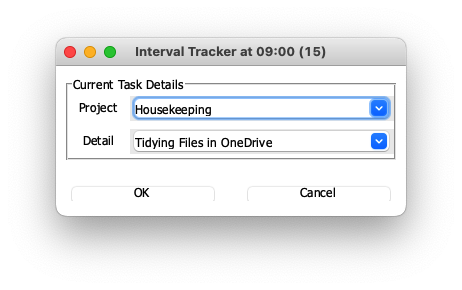

<span align="center">

[](https://www.python.org/downloads/)
[](https://github.com/astral-sh/uv)
[](https://github.com/billwallis/daily-tracker/actions/workflows/tests.yaml)
[](https://smarie.github.io/python-genbadge/)

[](https://results.pre-commit.ci/latest/github/billwallis/daily-tracker/main)
[](https://shields.io/)

</span>

---

# Daily Tracker ⏱️📝

An application for keeping track of tasks throughout the day.

Not sure where all your time goes? I wasn't either 😄 This application generates a pop-up box every 15 minutes (configurable) to fill out what you're currently working on.

> [!WARNING]
>
> This is a work in progress. I'm currently using it to track my time, but it's not yet ready for public consumption.

## Features

The GUI is currently built with [Tkinter](https://docs.python.org/3/library/tkinter.html) and looks like:

<div align="center">
    
</div>

This pop-up box has the following features:

- Drop-down box to select from recent projects
- Drop-down box to select the selected project's recent details
- By default, autopopulates the project and details from the previous entry
- Integrates with:
  - [Google Calendar ](https://calendar.google.com/)
  - [Outlook ](https://outlook.live.com/owa/)
  - [Jira ](https://www.atlassian.com/software/jira)
  - [Slack ](https://slack.com/)
  - [GitHub ](https://github.com/)
  - [Monday.com ](https://monday.com/)

## Resources and dependencies

The clock icon is from [icons8.com](https://icons8.com/):

- https://icons8.com/icon/2YPST59G2xJZ/clock

### macOS

On macOS, you will probably need to install [the Tcl/Tk framework](https://www.tcl-lang.org/):

```bash
brew install tcl-tk
```

More details available at:

- https://tkdocs.com/tutorial/install.html#install-macos

## Usage

Configure the [configuration.yaml](src/daily_tracker/resources/configuration.yaml) appropriately, and add any required [environment variables](.env.example). Check the available CLI commands with:

```shell
daily-tracker --help
```

## Contributing

Install [uv](https://docs.astral.sh/uv/getting-started/installation/) and then install the dependencies:

```bash
uvx --from poethepoet poe install
```
